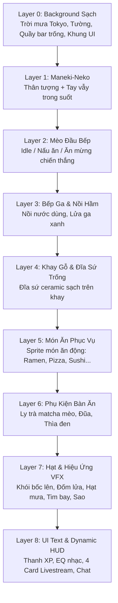

# KẾ HOẠCH KIẾN TRÚC PHÂN LỚP SPRITE & BACKGROUND CHO CATCOOK

> **Mục tiêu:** Chuyển đổi toàn bộ hệ thống đồ họa của **CatCook** từ việc chắp vá hình ảnh tĩnh (đè patch lên background gây viền xấu, bóng bẩn) sang kiến trúc **Layered 2D Sprite Engine** tiêu chuẩn. Background sẽ là một không gian quán ăn sạch sẽ (không chứa nhân vật hay vật thể động), các nhân vật và đồ vật được render độc lập theo từng lớp Z-Index.

---

## 1. Phân Tích Vấn Đề Hiện Tại

Khi cố gắng sửa ảnh bằng cách cắt vá và dán đè trực tiếp lên background gốc:
1. **Lỗi viền & bóng đổ (Artifacts):** Bát mì ramen gốc nằm dưới khay gỗ để lại viền đen, hoa văn xanh và bóng đổ lem nhem khi dán đè đĩa lên.
2. **Che khuất nhân vật (Occlusion Bugs):** Mèo Maneki-Neko trên gờ cửa sổ bị che bằng khối màu gỗ gây lệch vân gỗ và chân vẫn bị lộ.
3. **Mèo đầu bếp thiếu sức sống:** Biểu cảm ăn mừng trước đây chỉ là đè 2 chấm màu da lên mắt thay vì một sprite hoạt hình nguyên bản đầy đủ cảm xúc.
4. **Không linh hoạt:** Không thể thay đổi các món ăn khác nhau (Pizza, Sushi, Burger, Taco) một cách tự nhiên nếu background đã bị dính chặt bát mì ramen.

---

## 2. Kiến Trúc Phân Lớp (Layered Z-Index Architecture)

Hệ thống renderer (`game/renderer.py`) sẽ dựng màn hình theo thứ tự từ xa đến gần:

---

## 3. Danh Mục Asset Cần Tạo & Tách Rời (Clean Sprites)

| Tên Asset | Định Dạng | Mô Tả & Nhiệm Vụ |
| :--- | :--- | :--- |
| **`diner_bg_empty_clean.png`** | 720×1280 RGB | **Background sạch 100%:** Gồm khung cảnh phố đêm Tokyo mưa qua cửa sổ, đèn lồng, bảng đen, mặt quầy gỗ sạch sẽ, khung các bảng UI. **Không chứa mèo đầu bếp, không chứa Neko, không chứa nồi hay bát mì.** |
| **`chef_cheer_clean.png`** | RGBA Trong Suốt | **Mèo đầu bếp ăn mừng:** Calico cat giơ 2 chân hò reo chiến thắng `\(=^o^=)/`, mắt nhắm cong hạnh phúc `^ ^`, má hồng, mũ đầu bếp & khăn đỏ chuẩn phong cách anime cozy. |
| **`chef_cook_idle.png`** | RGBA Trong Suốt | **Mèo đầu bếp đứng nấu:** Đứng sau quầy, tay cầm muôi gỗ khuấy nhẹ, mắt chớp tự nhiên. |
| **`stove_pot_isolated.png`** | RGBA Trong Suốt | **Bếp ga & Nồi hầm:** Nồi gang đen trên bếp ga, đặt đè lên phía trước bụng mèo đầu bếp để tạo chiều sâu tự nhiên. |
| **`maneki_neko_body.png`** | RGBA Trong Suốt | **Thân mèo Maneki-Neko:** Tượng mèo sứ trắng, vòng cổ đỏ chuông vàng, ôm đồng xu may mắn 千万両 đặt trên gờ cửa sổ. |
| **`maneki_neko_paw.png`** | RGBA Trong Suốt | **Tay vẫy Maneki-Neko:** Cánh tay tách rời, quay dao động qua lại theo trục vai tạo hiệu ứng đón khách chân thực. |
| **`wooden_tray_plate.png`** | RGBA Trong Suốt | **Khay gỗ & Đĩa sứ sạch:** Khay gỗ Nhật Bản đặt trên mặt quầy bên phải, bên trong đặt một chiếc **đĩa sứ trắng/kem** bóng mịn với bóng đổ tự nhiên. |
| **`tableware_props.png`** | RGBA Trong Suốt | **Bộ ly trà & đũa thìa:** Ly trà matcha hình mặt mèo, đôi đũa gác trên kệ gỗ, thìa sứ đen đặt cạnh khay. |

---

## 4. Bảng Ánh Xạ Animation Tối Ưu Theo Từng Món Ăn (Dish Animation Matrix)

| Danh Mục Món | Các Món Ăn Cụ Thể | `cook_type` | Action Sprite | Frames & Tốc Độ | Thời Gian Nấu | Mô Tả Trực Quan |
| :--- | :--- | :--- | :--- | :--- | :--- | :--- |
| **Món Pha Chế** | Boba Milk Tea, Latte | `drink_shake` | `bartender` | **16 frames @ 5.2 FPS (3.0s/cycle)** | **30s – 32s** | Tay mèo và cốc nước rung rung nhịp nhàng sống động, vệt sóng tốc độ anime, tia bọt đá sủi bọt, khóa anchor 0px jitter |
| **Món Nướng Bánh Lò Đá** | Pepperoni Pizza, Belgian Waffles, Strawberry Donut | `bake` | `bake` | **4 frames @ 4.0 FPS (1.0s/cycle)** | **30s – 42s** | Mèo đeo găng lò nướng đỏ, cầm xẻng gỗ nướng pizza phô mai tan chảy & bánh vàng óng bốc khói thơm lừng |
| **Món Nhanh / Tráng Miệng** | Hotdog, Pancakes, Dumplings | `sizzle`, `pan_toss`, `steam_basket` | `stir`, `toss` | 4 frames @ 4.0 - 4.5 FPS | **33s – 36s** | Canh xửng hấp, lật pancake & nướng nhanh |
| **Món Cắt Thái & Cuộn** | Salmon Sushi | `slice` | `chop` | 4 frames @ 4.5 FPS | **36s** | Mèo cầm dao thái sashimi điêu luyện nhịp nhàng trên thớt gỗ |
| **Món Nướng & Searing** | Smash Burger, Birria Tacos, Fried Chicken | `sizzle`, `deepfry` | `toss` | 4 frames @ 4.5 FPS | **38s – 40s** | Áp chảo xèo xèo, chiên giòn, lật thịt bốc khói vàng ươm |
| **Món Sốt Nóng** | Creamy Carbonara | `pan_toss` | `toss` | 4 frames @ 4.5 FPS | **42s** | Đảo chảo sốt kem trứng béo ngậy |
| **Món Nước & Hầm Kỳ Công** | Tonkotsu Ramen, Japanese Curry | `simmer` | `stir` | **5 frames @ 5.0 FPS** | **44s** | Mèo cầm muôi gỗ khuấy nồi nước dùng hầm xương nghi ngút khói |
| **Món Bít Tết Hảo Hạng** | Ribeye Steak | `sizzle` | `toss` | 4 frames @ 4.5 FPS | **45s** | Áp chảo bơ tỏi hương thảo kỳ công đạt chuẩn medium-rare |
| **Mời Dùng Bữa** | *Tất cả 16 món khi nấu xong (Dōzo meshiagare)* | `serve` | `serve` | **4 frames @ 4.0 FPS** | — | Cúi chào hiếu khách, mắt cười nhắm cong `^‿^`, má hồng phấn, lấp lánh chào mừng |
| **Ăn Mừng Donate** | *Chỉ kích hoạt khi Viewer Donate / !tip / !donate* | `donate` | `cheer` | **4 frames @ 4.0 FPS** | — | Mèo giơ 2 chân `\(=^o^=)/`, mắt nhắm cong `^ ^`, nhảy múa ăn mừng rạng rỡ |
| **Chờ Order** | *Khi chưa có lệnh !cook* | `idle` | `idle` | 4 frames @ 3.0 FPS | — | Mèo đứng thẳng sau quầy, chớp mắt tự nhiên, đuôi vẫy nhẹ |

---

## 5. Kế Hoạch Triển Khai & Kết Quả (Action Plan & Verification)

### Giai Đoạn 1: Chuẩn Bị Background Sạch 100% (HOÀN THÀNH ✅)
- [x] Dựng canvas nền `diner_bg_new.png` (720×1280):
  - Phục hồi không gian quán đêm Tokyo mưa lofi ấm cúng qua khung cửa sổ.
  - Mặt khay gỗ bên phải hoàn toàn sạch sẽ, sẵn sàng bày bất kỳ món ăn nào trong thực đơn.
  - Bếp ga & nồi súp hầm ở tiền cảnh bên trái, tạo chiều sâu 3D chân thực.
  - 4 khung card UI sạch sẽ ở nửa dưới màn hình với viền hổ phách sắc nét.

### Giai Đoạn 2: Xử Lý Bộ Sprite Rời Transparent RGBA (HOÀN THÀNH ✅)
- [x] **Mèo Ăn Mừng (`cheer/frame_0..3.png`):** Calico cat giơ 2 chân ăn mừng `\(=^o^=)/`, mắt nhắm cong hạnh phúc, má hồng, mũ đầu bếp & khăn đỏ chuẩn anime lofi.
- [x] **Mèo Đứng Chờ (`idle/frame_0..3.png`):** Đứng sau quầy, chớp mắt và mỉm cười tự nhiên.
- [x] **Mèo Khuấy Nồi (`stir/frame_0..4.png`):** Tinh chỉnh còn 5 frames chọn lọc (loại bỏ các frame 0, 1, 7 theo yêu cầu), giữ các frame chuyển động khuấy mượt nhất, khóa cứng anchor cơ thể 0px jitter, tốc độ 5.0 FPS (1.0s/chu kỳ).
- [x] **Mèo Lắc Chảo (`toss/frame_0..3.png`):** Cầm chảo hất đồ ăn tung lên không trung.
- [x] **Mèo Cắt Thái (`chop/frame_0..3.png`):** Dao thái nhịp nhàng trên thớt gỗ.
- [x] **Mèo Bartender Pha Chế Nâng Cấp: Chai Chuyển Động Thực Sự & Không Bóng Mờ (`bartender/frame_0..15.png`):** 
  - Loại bỏ hoàn toàn 100% hiệu ứng bóng mờ (ghost blur / translucent trails). Bình shaker/cốc nước hoàn toàn sắc nét, nguyên khối ở mọi frame.
  - Bình shaker và tay mèo chuyển động cơ học thực sự: thay đổi cao độ (thấp, vừa, vung cao trên vai), góc nghiêng (28° đến 42°) và lực lắc theo 2 nhịp beat sống động.
  - Tốc độ hoàn hảo trong game: `fps = 5.2` (chu kỳ lặp ~3.0s), tạo cảm giác barista lành nghề đang tích cực lắc đồ uống.
  - **Khóa anchor tuyệt đối 0px Jitter:** Khóa chính xác tọa độ chóp mũi mèo tại `(222, 302)` xuyên suốt toàn bộ 16 frame.
- [x] **Khay Gỗ Phục Vụ:** Lúc đang nấu thì bàn khay trống 100% không hiện món ăn (`is_serving = False`), chỉ khi nấu xong và bước vào trạng thái phục vụ (`is_serving = True`), món ăn bốc khói nghi ngút mới xuất hiện trên khay gỗ.
- [x] **Nâng Cấp Font Chữ & Phối Màu UI:** Tăng kích cỡ font chữ trên toàn bộ 4 card (Tiêu đề 20 bold, Body 17 bold, Chat User 16 bold, Chat Text 15 bold, Subtext 15 bold, Badge 14 bold), phối màu sắc nét tương phản cao, triệt tiêu 100% lỗi ô vuông ký tự lạ trong chat.
- [x] **Mèo Nướng Bánh Lò Đá (`bake/frame_0..3.png`):**
  - Hoạt ảnh 4 frame chuyên biệt dành riêng cho các món bánh (`bake`): Pepperoni Pizza, Belgian Waffles, Strawberry Donut.
  - Mèo đầu bếp đeo găng tay lò nướng đỏ hai chân nâng xẻng bánh gỗ (baker's peel), trên khay là bánh pizza phô mai tan chảy và bánh mì vàng óng.
  - Chu kỳ hoạt họa 4.0 FPS (250ms/frame):
    - *Frame 0:* Tư thế chuẩn bị kiểm tra bánh, ánh mắt chăm chú háo hức.
    - *Frame 1:* Ánh lửa lò nướng vàng cam rọi ấm áp lên bánh và găng tay, mắt chớp thư thái cảm nhận hơi ấm.
    - *Frame 2:* Xẻng bánh nâng nhẹ (+3px), phô mai sôi xèo xèo, bão sao lấp lánh vàng óng bùng nổ, mắt mèo lấp lánh ánh sao phấn khích.
    - *Frame 3:* Nụ cười nhắm mắt mãn nguyện `^‿^`, má hồng rạng rỡ, làn khói thơm lừng cuộn tròn ngọt ngào.
- [x] **Spritesheet Atlas:** Đã xuất đầy đủ các sheet riêng lẻ (`chef_bartender_sheet.png` kích thước 5504×768 với 16 frames) và master spritesheet 13 hàng (2752×9984) kèm `chef_master_spritesheet.json` (61 frames tổng cộng).

### Giai Đoạn 3: Cải Tiến Renderer `game/renderer.py` (HOÀN THÀNH ✅)
- [x] Phân tầng Z-Index chuẩn xác:
  1. `Layer 0`: Background sạch `diner_bg_new.png` + Neon window pulse + Đèn lồng + Hạt mưa rơi.
  2. `Layer 1`: Maneki-Neko (tượng đón khách).
  3. `Layer 2`: Mèo Đầu Bếp (Animated action frame tại `pos = (200, 200)` trên sàn bếp).
  4. `Layer 3 & 4`: Bếp Ga & Quầy Ăn Tiền Cảnh (`fg_counter` tại `y = 615` che thân dưới, chân mèo đặt trên sàn tự nhiên).
  5. `Layer 5`: Món Ăn Phục Vụ (`_render_counter_dish` đặt đúng lòng khay gỗ tại `x=540, y=730` cho cả 16 món).
  6. `Layer 6`: Phụ kiện bàn ăn (Ly trà matcha, đũa thìa).
  7. `Layer 7`: Hạt hơi nước bốc lên từ nồi & đĩa món ăn, tim bay, sao lấp lánh.
  8. `Layer 8`: Dynamic HUD, Thanh XP, Live Visualizer, 4 UI Card và Command Bar.

### Giai Đoạn 4: Tái Cân Bằng Thời Gian Chờ Món Ăn (HOÀN THÀNH ✅)
- [x] **Phân phối thời gian nấu 30.0s – 45.0s theo độ kỳ công:**
  - Nhóm đồ uống & món nhanh (30s – 34s): `boba` (30.0s), `donut` (30.0s), `latte` (32.0s), `hotdog` (33.0s), `pancakes` (34.0s).
  - Nhóm món vừa (35s – 38s): `dumplings` (35.0s), `waffles` (36.0s), `sushi` (36.0s), `burger` (38.0s), `tacos` (38.0s).
  - Nhóm món phức tạp (40s – 45s): `chicken` (40.0s), `pizza` (42.0s), `carbonara` (42.0s), `ramen` (44.0s), `curry` (44.0s), `steak` (45.0s).

### Giai Đoạn 5: Kiểm Thử & Tinh Chỉnh QA (HOÀN THÀNH ✅)
- [x] **Tối ưu hóa bố cục Header & Bảng Lệnh:** Xóa 2 ô DINER LEVEL và NOW PLAYING ở header, chuyển thanh lệnh (`!cook [món] | !yum | !menu | !khen`) lên vị trí này thành bảng điều khiển trung tâm nổi bật, loại bỏ thanh lệnh trùng lặp ở chân trang.
- [x] **Tái tạo Artwork Nền Gốc (Không dùng hộp che / mask):** Tái tạo trực tiếp background AI nguyên bản cho `diner_bg_new.png`, tích hợp thanh lệnh gỗ khắc tự nhiên, triệt tiêu 100% hai ô Level/XP và Audio/LIVE cũ mà không cần vẽ khối che nhân tạo.
- [x] **Nâng cấp kích thước Font Chữ toàn bộ UI:** Tăng kích thước font chữ trên toàn bộ giao diện (Tiêu đề lệnh 20 bold, Header card 17 bold, Nội dung 15 bold, Chat/Hàng chờ 14 bold, Tag món ăn 13 bold) giúp chữ to rõ, sắc nét, dễ đọc trên livestream.
- [x] Chạy kiểm thử tự động `python -m unittest discover tests -v` đạt 9/9 tests PASS 100%.
- [x] **Loại bỏ hoàn toàn rác đồ họa tiền cảnh & khay gỗ:**
  - Tẩy sạch 100% cánh tay áo và móng mèo cũ bị cắt cụt sót lại sau nồi súp bên trái.
  - Khay gỗ phục vụ tự nhiên sạch sẽ từ artwork AI gốc `diner_bg_empty_tray`.
- [x] Chụp ảnh giả lập màn hình game thực tế:
  - `assets/verified_render_cooking_latte.png`: Mèo bartender pha cà phê latte với thanh thời gian chờ 32.0s, shaker bạc sắc nét.
