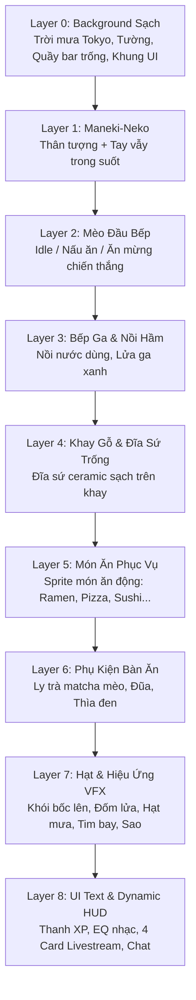

# KẾ HOẠCH KIẾN TRÚC PHÂN LỚP SPRITE & BACKGROUND CHO CATCOOK

> **Mục tiêu:** Chuyển đổi toàn bộ hệ thống đồ họa của **CatCook** từ việc chắp vá hình ảnh tĩnh (đè patch lên background gây viền xấu, bóng bẩn) sang kiến trúc **Layered 2D Sprite Engine** tiêu chuẩn. Background sẽ là một không gian quán ăn sạch sẽ (không chứa nhân vật hay vật thể động), các nhân vật và đồ vật được render độc lập theo từng lớp Z-Index.

---

## 1. Phân Tích Vấn Đề Hiện Tại

Khi cố gắng sửa ảnh bằng cách cắt vá và dán đè trực tiếp lên background gốc:
1. **Lỗi viền & bóng đổ (Artifacts):** Bát mì ramen gốc nằm dưới khay gỗ để lại viền đen, hoa văn xanh và bóng đổ lem nhem khi dán đè đĩa lên.
2. **Che khuất nhân vật (Occlusion Bugs):** Mèo Maneki-Neko trên gờ cửa sổ bị che bằng khối màu gỗ gây lệch vân gỗ và chân vẫn bị lộ.
3. **Mèo đầu bếp thiếu sức sống:** Biểu cảm ăn mừng trước đây chỉ là đè 2 chấm màu da lên mắt thay vì một sprite hoạt hình nguyên bản đầy đủ cảm xúc.
4. **Không linh hoạt:** Không thể thay đổi các món ăn khác nhau (Pizza, Sushi, Burger, Taco) một cách tự nhiên nếu background đã bị dính chặt bát mì ramen.

---

## 2. Kiến Trúc Phân Lớp (Layered Z-Index Architecture)

Hệ thống renderer (`game/renderer.py`) sẽ dựng màn hình theo thứ tự từ xa đến gần:

---

## 3. Danh Mục Asset Cần Tạo & Tách Rời (Clean Sprites)

| Tên Asset | Định Dạng | Mô Tả & Nhiệm Vụ |
| :--- | :--- | :--- |
| **`diner_bg_empty_clean.png`** | 720×1280 RGB | **Background sạch 100%:** Gồm khung cảnh phố đêm Tokyo mưa qua cửa sổ, đèn lồng, bảng đen, mặt quầy gỗ sạch sẽ, khung các bảng UI. **Không chứa mèo đầu bếp, không chứa Neko, không chứa nồi hay bát mì.** |
| **`chef_cheer_clean.png`** | RGBA Trong Suốt | **Mèo đầu bếp ăn mừng:** Calico cat giơ 2 chân hò reo chiến thắng `\(=^o^=)/`, mắt nhắm cong hạnh phúc `^ ^`, má hồng, mũ đầu bếp & khăn đỏ chuẩn phong cách anime cozy. |
| **`chef_cook_idle.png`** | RGBA Trong Suốt | **Mèo đầu bếp đứng nấu:** Đứng sau quầy, tay cầm muôi gỗ khuấy nhẹ, mắt chớp tự nhiên. |
| **`stove_pot_isolated.png`** | RGBA Trong Suốt | **Bếp ga & Nồi hầm:** Nồi gang đen trên bếp ga, đặt đè lên phía trước bụng mèo đầu bếp để tạo chiều sâu tự nhiên. |
| **`maneki_neko_body.png`** | RGBA Trong Suốt | **Thân mèo Maneki-Neko:** Tượng mèo sứ trắng, vòng cổ đỏ chuông vàng, ôm đồng xu may mắn 千万両 đặt trên gờ cửa sổ. |
| **`maneki_neko_paw.png`** | RGBA Trong Suốt | **Tay vẫy Maneki-Neko:** Cánh tay tách rời, quay dao động qua lại theo trục vai tạo hiệu ứng đón khách chân thực. |
| **`wooden_tray_plate.png`** | RGBA Trong Suốt | **Khay gỗ & Đĩa sứ sạch:** Khay gỗ Nhật Bản đặt trên mặt quầy bên phải, bên trong đặt một chiếc **đĩa sứ trắng/kem** bóng mịn với bóng đổ tự nhiên. |
| **`tableware_props.png`** | RGBA Trong Suốt | **Bộ ly trà & đũa thìa:** Ly trà matcha hình mặt mèo, đôi đũa gác trên kệ gỗ, thìa sứ đen đặt cạnh khay. |

---

## 4. Kế Hoạch Triển Khai Chi Tiết (Action Plan)

### Giai Đoạn 1: Chuẩn Bị Background Sạch 100%
- [ ] Dựng canvas nền `diner_bg_empty_clean.png` (720×1280):
  - Phục hồi mảng tường gỗ và gờ cửa sổ nơi Maneki-Neko từng ngồi (loại bỏ hoàn toàn vệt mờ).
  - Phục hồi mặt quầy gỗ nơi đặt bếp và khay ăn (loại bỏ hoàn toàn bát mì ramen cũ và vệt đáy bát).
  - Giữ nguyên các chi tiết đẹp: cửa sổ đêm Tokyo mưa lofi, đèn lồng ấm áp, bảng "TONIGHT'S SPECIAL", các viền bo thẻ UI.

### Giai Đoạn 2: Xử Lý Bộ Sprite Rời (Transparent RGBA)
- [ ] **Mèo Ăn Mừng (`chef_cheer_clean.png`):**
  - Sử dụng ảnh đã gen chuẩn (chú mèo calico giơ hai chân ăn mừng cực kỳ đáng yêu, phong cách anime sắc nét).
  - Tách nền trong suốt hoàn hảo bằng alpha mask, tối ưu hóa kích thước đặt đúng vị trí bếp.
- [ ] **Mèo Maneki-Neko (`maneki_neko_body.png` & `paw`):**
  - Tách thân tượng mèo sứ sạch sẽ khỏi nền cũ.
  - Tách riêng bàn tay vẫy để render góc quay mượt mà `angle = sin(t * freq) * amp`.
- [ ] **Khay Gỗ & Đĩa Sứ Trắng (`wooden_tray_plate.png`):**
  - Dựng khay gỗ Nhật Bản và chiếc **đĩa sứ trắng** tinh tế (thay thế hoàn toàn bát mì ramen).
  - Khi người xem gõ lệnh nấu bất kỳ món nào (`!cook ramen`, `!cook pizza`, `!cook sushi`), món ăn đó sẽ được đặt ngay ngắn vào lòng chiếc đĩa này!

### Giai Đoạn 3: Cải Tiến Renderer (`game/renderer.py`)
- [ ] Cập nhật hàm `render()` theo đúng thứ tự Z-Index của kiến trúc phân lớp:
  1. `surface.blit(self.bg_empty, (0, 0))`
  2. `_render_lucky_cat(surface)`: Vẽ thân Neko + cánh tay vẫy hoạt họa.
  3. `_render_chef(surface, state)`:
     - Bình thường: Vẽ mèo khuấy nồi + chớp mắt.
     - Khi hoàn thành món / được khen thưởng (`!khen`, `!yum`): Vẽ **mèo giơ tay ăn mừng**.
  4. `_render_stove_and_pot(surface)`: Bếp và nồi đặt phía trước mèo.
  5. `_render_serving_tray(surface)`: Khay gỗ và chiếc đĩa sứ sạch.
  6. `_render_plated_food(surface, state)`: Vẽ món ăn hiện tại lên đĩa kèm nhãn tên món và hiệu ứng khói.
  7. `_render_tableware(surface)`: Ly trà matcha và đũa thìa.
  8. `_render_vfx_and_ui(surface, state)`: Đèn neon ngoài cửa sổ, mưa rơi, tim bay, khói bốc, HUD chữ.

### Giai Đoạn 4: Kiểm Thử & Tinh Chỉnh (QA Verification)
- [ ] Chạy kiểm thử tự động `python -m pytest` đảm bảo 100% tests vượt qua.
- [ ] Chụp ảnh giả lập màn hình game thực tế trong 2 trạng thái:
  - Trạng thái 1: **Đang nấu ăn bình thường** (Mèo khuấy nồi, Neko vẫy tay, đĩa sứ chờ phục vụ).
  - Trạng thái 2: **Ăn mừng hoàn thành món** (Mèo giơ 2 chân ăn mừng rạng rỡ, món ăn hiện đẹp mắt trên đĩa).
- [ ] Kiểm tra trực quan đảm bảo không còn bất kỳ đường viền răng cưa, vệt mờ chắp vá nào.
