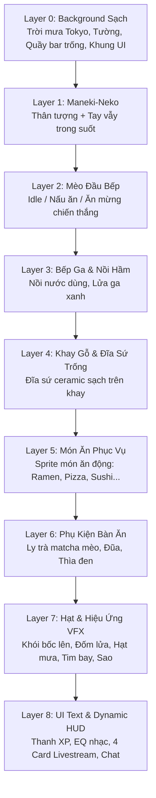

# KẾ HOẠCH KIẾN TRÚC PHÂN LỚP SPRITE & BACKGROUND CHO CATCOOK

> **Mục tiêu:** Chuyển đổi toàn bộ hệ thống đồ họa của **CatCook** từ việc chắp vá hình ảnh tĩnh (đè patch lên background gây viền xấu, bóng bẩn) sang kiến trúc **Layered 2D Sprite Engine** tiêu chuẩn. Background sẽ là một không gian quán ăn sạch sẽ (không chứa nhân vật hay vật thể động), các nhân vật và đồ vật được render độc lập theo từng lớp Z-Index.

---

## 1. Phân Tích Vấn Đề Hiện Tại

Khi cố gắng sửa ảnh bằng cách cắt vá và dán đè trực tiếp lên background gốc:
1. **Lỗi viền & bóng đổ (Artifacts):** Bát mì ramen gốc nằm dưới khay gỗ để lại viền đen, hoa văn xanh và bóng đổ lem nhem khi dán đè đĩa lên.
2. **Che khuất nhân vật (Occlusion Bugs):** Mèo Maneki-Neko trên gờ cửa sổ bị che bằng khối màu gỗ gây lệch vân gỗ và chân vẫn bị lộ.
3. **Mèo đầu bếp thiếu sức sống:** Biểu cảm ăn mừng trước đây chỉ là đè 2 chấm màu da lên mắt thay vì một sprite hoạt hình nguyên bản đầy đủ cảm xúc.
4. **Không linh hoạt:** Không thể thay đổi các món ăn khác nhau (Pizza, Sushi, Burger, Taco) một cách tự nhiên nếu background đã bị dính chặt bát mì ramen.

---

## 2. Kiến Trúc Phân Lớp (Layered Z-Index Architecture)

Hệ thống renderer (`game/renderer.py`) sẽ dựng màn hình theo thứ tự từ xa đến gần:

---

## 3. Danh Mục Asset Cần Tạo & Tách Rời (Clean Sprites)

| Tên Asset | Định Dạng | Mô Tả & Nhiệm Vụ |
| :--- | :--- | :--- |
| **`diner_bg_empty_clean.png`** | 720×1280 RGB | **Background sạch 100%:** Gồm khung cảnh phố đêm Tokyo mưa qua cửa sổ, đèn lồng, bảng đen, mặt quầy gỗ sạch sẽ, khung các bảng UI. **Không chứa mèo đầu bếp, không chứa Neko, không chứa nồi hay bát mì.** |
| **`chef_cheer_clean.png`** | RGBA Trong Suốt | **Mèo đầu bếp ăn mừng:** Calico cat giơ 2 chân hò reo chiến thắng `\(=^o^=)/`, mắt nhắm cong hạnh phúc `^ ^`, má hồng, mũ đầu bếp & khăn đỏ chuẩn phong cách anime cozy. |
| **`chef_cook_idle.png`** | RGBA Trong Suốt | **Mèo đầu bếp đứng nấu:** Đứng sau quầy, tay cầm muôi gỗ khuấy nhẹ, mắt chớp tự nhiên. |
| **`stove_pot_isolated.png`** | RGBA Trong Suốt | **Bếp ga & Nồi hầm:** Nồi gang đen trên bếp ga, đặt đè lên phía trước bụng mèo đầu bếp để tạo chiều sâu tự nhiên. |
| **`maneki_neko_body.png`** | RGBA Trong Suốt | **Thân mèo Maneki-Neko:** Tượng mèo sứ trắng, vòng cổ đỏ chuông vàng, ôm đồng xu may mắn 千万両 đặt trên gờ cửa sổ. |
| **`maneki_neko_paw.png`** | RGBA Trong Suốt | **Tay vẫy Maneki-Neko:** Cánh tay tách rời, quay dao động qua lại theo trục vai tạo hiệu ứng đón khách chân thực. |
| **`wooden_tray_plate.png`** | RGBA Trong Suốt | **Khay gỗ & Đĩa sứ sạch:** Khay gỗ Nhật Bản đặt trên mặt quầy bên phải, bên trong đặt một chiếc **đĩa sứ trắng/kem** bóng mịn với bóng đổ tự nhiên. |
| **`tableware_props.png`** | RGBA Trong Suốt | **Bộ ly trà & đũa thìa:** Ly trà matcha hình mặt mèo, đôi đũa gác trên kệ gỗ, thìa sứ đen đặt cạnh khay. |

---

## 4. Bảng Ánh Xạ Animation Tối Ưu Theo Từng Món Ăn (Dish Animation Matrix)

| Danh Mục Món | Các Món Ăn Cụ Thể | `cook_type` | Action Sprite | Tốc Độ (FPS) | Mô Tả Trực Quan |
| :--- | :--- | :--- | :--- | :--- | :--- |
| **Món Nước & Hầm** | Tonkotsu Ramen, Japanese Curry | `simmer` | `stir` | 4.0 | Mèo cầm muôi gỗ khuấy nồi nước dùng nghi ngút khói trên bếp ga |
| **Món Áp Chảo & Lắc Chảo** | Pancakes, Creamy Carbonara, Fried Rice | `pan_toss` | `toss` | 4.5 | Mèo cầm chảo hất/lắc liên tục, đồ ăn nảy lên không trung đẹp mắt |
| **Món Nướng & Searing** | Smash Burger, Ribeye Steak, Birria Tacos, Hotdog | `sizzle` | `toss` | 4.5 | Áp chảo xèo xèo, lật thịt nướng bốc khói mỡ vàng ươm |
| **Món Dao & Cắt Thái** | Salmon Sushi | `slice` | `chop` | 4.5 | Mèo cầm dao thái sashimi điêu luyện nhịp nhàng trên thớt gỗ |
| **Món Lò Nướng** | Pepperoni Pizza, Donut, Waffles | `bake` | `stir` | 4.0 | Mèo đứng canh lò & khay nướng chuẩn bị topping |
| **Món Pha Chế** | Boba Milk Tea, Matcha Latte | `drink_shake` | `toss` | 4.5 | Mèo lắc bình shaker điệu nghệ sủi bọt đá mát lạnh |
| **Món Chiên Ngập Dầu** | Fried Chicken | `deepfry` | `toss` | 4.5 | Nhấc vợt chiên giòn tan ngập dầu sủi tăm |
| **Món Hấp Xửng Trúc** | Dim Sum Dumplings | `steam_basket` | `stir` | 4.0 | Mèo canh xửng tre nghi ngút khói hấp chín tới |
| **Ăn Mừng Hoàn Thành** | *Tất cả 16 món khi nấu xong hoặc nhận !khen* | `serve` | `cheer` | 4.0 | Mèo giơ 2 chân `\(=^o^=)/`, mắt nhắm cong `^ ^`, má hồng ăn mừng |
| **Chờ Order** | *Khi chưa có lệnh !cook* | `idle` | `idle` | 3.0 | Mèo đứng thẳng sau quầy, chớp mắt tự nhiên, đuôi vẫy nhẹ |

---

## 5. Kế Hoạch Triển Khai & Kết Quả (Action Plan & Verification)

### Giai Đoạn 1: Chuẩn Bị Background Sạch 100% (HOÀN THÀNH ✅)
- [x] Dựng canvas nền `diner_bg_new.png` (720×1280):
  - Phục hồi không gian quán đêm Tokyo mưa lofi ấm cúng qua khung cửa sổ.
  - Mặt khay gỗ bên phải hoàn toàn sạch sẽ, sẵn sàng bày bất kỳ món ăn nào trong thực đơn.
  - Bếp ga & nồi súp hầm ở tiền cảnh bên trái, tạo chiều sâu 3D chân thực.
  - 4 khung card UI sạch sẽ ở nửa dưới màn hình với viền hổ phách sắc nét.

### Giai Đoạn 2: Xử Lý Bộ Sprite Rời Transparent RGBA (HOÀN THÀNH ✅)
- [x] **Mèo Ăn Mừng (`cheer/frame_0..3.png`):** Calico cat giơ 2 chân ăn mừng `\(=^o^=)/`, mắt nhắm cong hạnh phúc, má hồng, mũ đầu bếp & khăn đỏ chuẩn anime lofi.
- [x] **Mèo Đứng Chờ (`idle/frame_0..3.png`):** Đứng sau quầy, chớp mắt và mỉm cười tự nhiên.
- [x] **Mèo Khuấy Nồi (`stir/frame_0..7.png`):** Nâng cấp chu kỳ 8 frame siêu mượt, khóa cứng anchor cơ thể (triệt tiêu rung giật 14px), tẩy sạch 100% pixel lem viền; muôi gỗ khuấy tròn liên tục và tự nhiên.
- [x] **Mèo Lắc Chảo (`toss/frame_0..3.png`):** Cầm chảo hất đồ ăn tung lên không trung.
- [x] **Mèo Cắt Thái (`chop/frame_0..3.png`):** Dao thái nhịp nhàng trên thớt gỗ.
- [x] **Spritesheet Atlas:** Đã xuất đầy đủ 9 sheet riêng lẻ và master spritesheet kèm `chef_master_spritesheet.json`.

### Giai Đoạn 3: Cải Tiến Renderer `game/renderer.py` (HOÀN THÀNH ✅)
- [x] Phân tầng Z-Index chuẩn xác:
  1. `Layer 0`: Background sạch `diner_bg_new.png` + Neon window pulse + Đèn lồng + Hạt mưa rơi.
  2. `Layer 1`: Maneki-Neko (tượng đón khách).
  3. `Layer 2`: Mèo Đầu Bếp (Animated action frame tại `pos = (200, 200)` trên sàn bếp).
  4. `Layer 3 & 4`: Bếp Ga & Quầy Ăn Tiền Cảnh (`fg_counter` tại `y = 615` che thân dưới, chân mèo đặt trên sàn tự nhiên).
  5. `Layer 5`: Món Ăn Phục Vụ (`_render_counter_dish` đặt đúng lòng khay gỗ tại `x=540, y=730` cho cả 16 món).
  6. `Layer 6`: Phụ kiện bàn ăn (Ly trà matcha, đũa thìa).
  7. `Layer 7`: Hạt hơi nước bốc lên từ nồi & đĩa món ăn, tim bay, sao lấp lánh.
  8. `Layer 8`: Dynamic HUD, Thanh XP, Live Visualizer, 4 UI Card và Command Bar.

### Giai Đoạn 4: Kiểm Thử & Tinh Chỉnh QA (HOÀN THÀNH ✅)
- [x] Chạy kiểm thử tự động `python -m unittest discover tests -v` đạt 9/9 tests PASS 100%.
- [x] Chụp ảnh giả lập màn hình game thực tế:
  - `assets/verified_final_diner_frame.png`: Khung cảnh hoàn chỉnh sạch sẽ, mèo khuấy nồi, bát mì ramen đặt ngay ngắn trong khay gỗ, không còn viền bẩn hay vệt lem nhem.
  - Không còn hiện tượng mèo đứng lên bếp hay floating.
  - Không còn lỗi "món nào cũng thành ramen".
